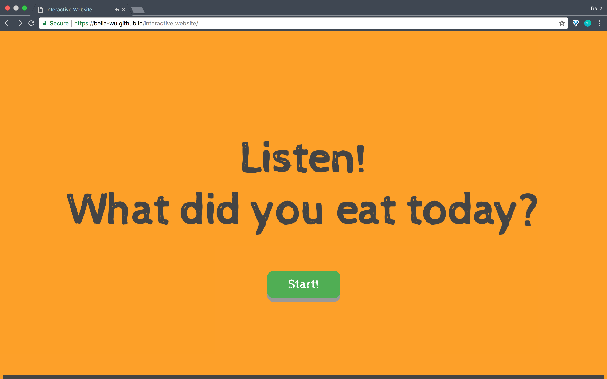
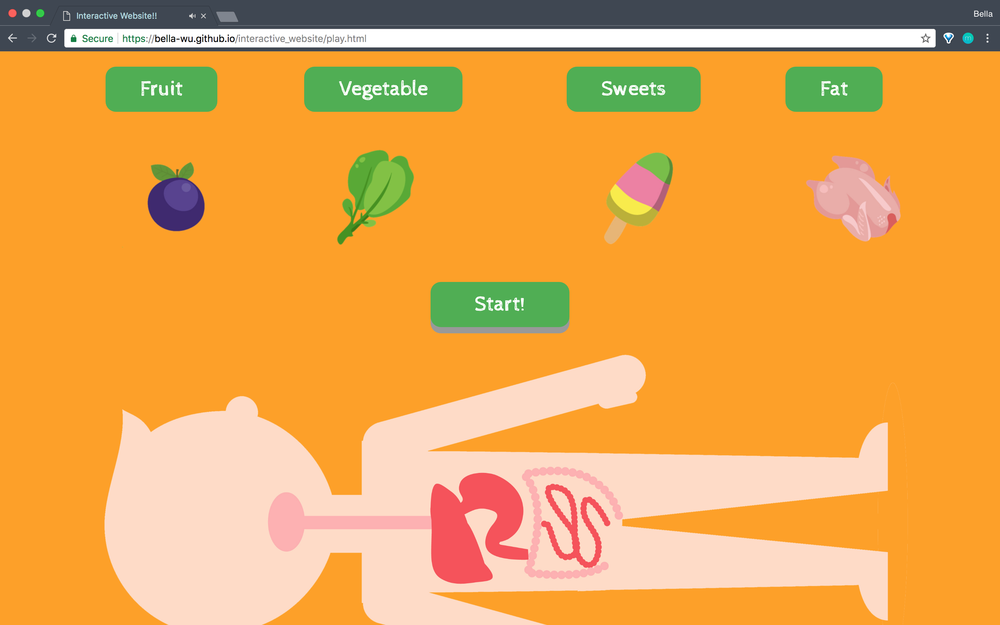
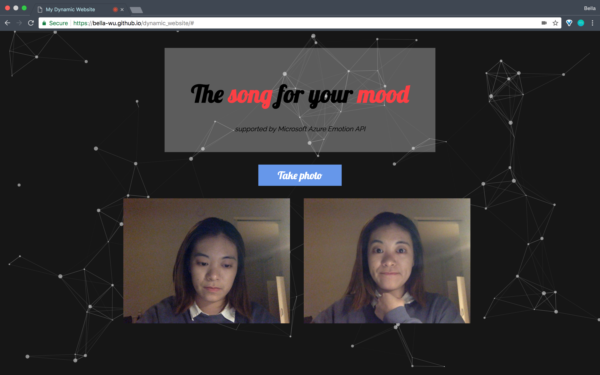
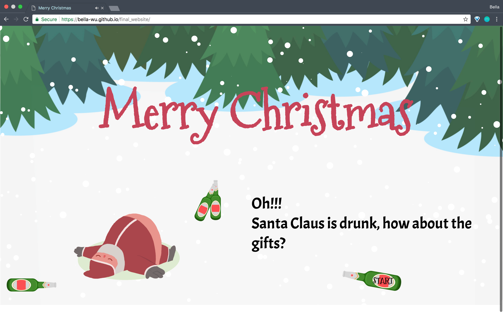
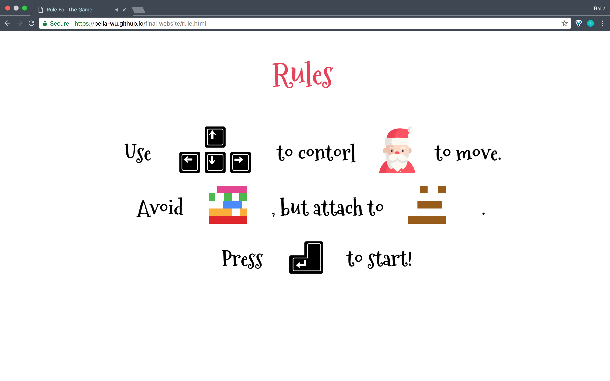
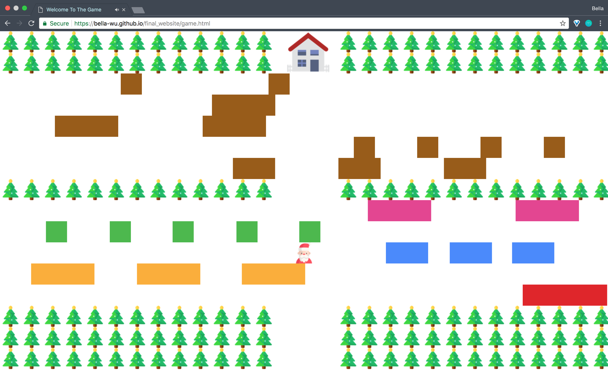
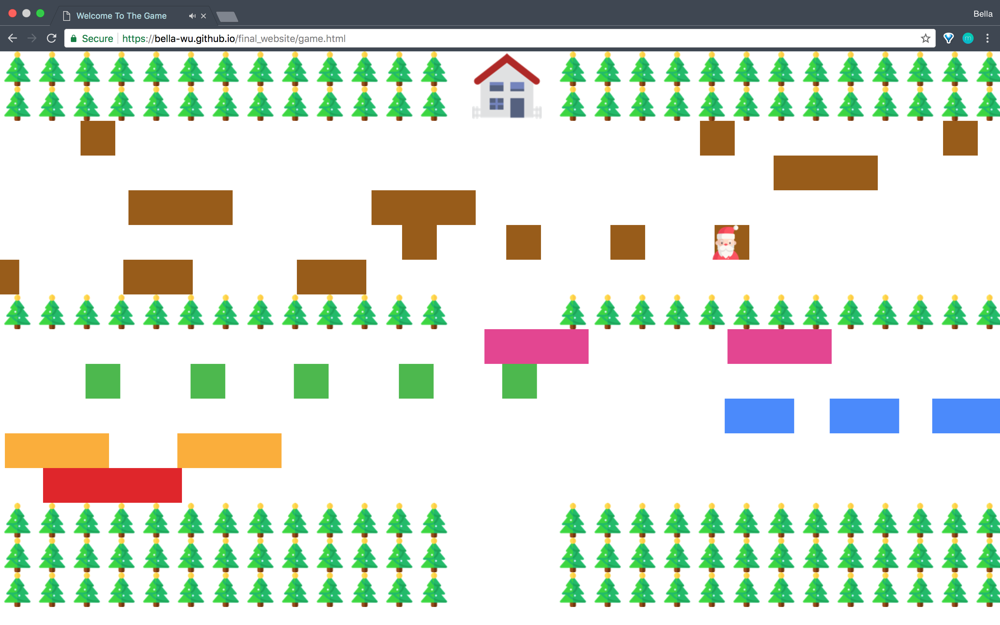

# Bella-WU.github.io
### Description
During my first semester in MAFDT, I took elective Web Advanced: Javascript in order to consolidate and expand my skills in web development with JavaScript and jQuery. This course was taught by Todd Anderson (https://toddwords.com/) (https://github.com/toddwords).

### My Projects
#### :one: Generative Website
- Links: https://bella-wu.github.io/generator_website/

- Requirement: Make a web page where a significant portion of the content changes every time the page is loaded. Use jQuery to select elements and change their contents. Use some form of generative text, either selecting text from a list, Tracery or Markov Chain. Can be any kind of web page, with any look, be creative!

#### :two: Interactive Website
- Links: https://bella-wu.github.io/interactive_website/

- Requirement: Create a website with a high amount of user interactivity. Use jQuery Events and/or p5 to create an interactive experience using some combination of images, sounds, video and animation.

#### :three: Dynamic Website
- Links: https://bella-wu.github.io/dynamic_website/
- Requirement: Create a website that uses a node.js server backend or API to load content dynamically. Could be a site that loads content unique to each user, or one that facilitates real-time interaction between users either remotely or in an installation.

#### :four: Final Website
- Links: https://bella-wu.github.io/final_website/
- Requirement: Students choice of a substantial project making significant use of Javascript.

